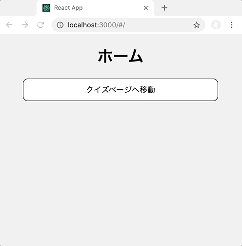

# レポジトリ内容

この課題は、Web白熱教室のReact課題その6「[【エクササイズ】2画面を持つクイズアプリをReactで実装する](https://tsuyopon.xyz/learning-contents/web-dev/javascript/react/js-exercise-for-react-router-1/)」の課題レポジトリになります。

## 課題

- 以下の完成形の画像と同じ見た目になるように実装する
- 具体的な実装の流れは、以下の「課題をクリアするためのステップ」の内容を参考にすること
- answerブランチでサンプルコード(解答コード)を用意しているが、あくまでもサンプルコードという立ち位置で、サンプルコードと全く同じ構成・実装である必要は無い

## 完成形

### 課題をクリアするためのステップ(実装のヒント)

- [ ] Reactの開発環境を用意
    - create-react-appを使う場合は`npx create-react-app .` で現在のディレクトリにReactの開発環境を用意できる
- [ ] 開発しやすいように不要なファイルは一度削除する
    - 参考記事: [【React】JSXの概要を理解する&必要最小限の環境に修正する](https://tsuyopon.xyz/learning-contents/web-dev/javascript/react/what-is-the-jsx-and-modify-env/)
- [ ] クイズデータの取得やクイズデータの操作を扱いやすくするモジュール(クラス)を実装する
    - `mocha`や `jest` といったテストツールを使って、動作をテストしながら実装することをオススメする
        - answerブランチに用意したサンプルコードでは `jest` を使った
    - answerブランチに実装したサンプルコードでは次の2つのモジュールを用意した
        - data_fetchers/QuizFetcher.js
            - クイズデータの取得の責務を持つ
        - models/Quiz.js
            - クイズデータを使った処理の責務を持つ
- [ ] トップページ用のコンポーネントと、クイズページ用のコンポーネントを作成して、React Routerを使ってルーティング設定をする
- [ ] クイズページ用のコンポーネントで、次の機能を実装する
    - クイズの読み込み機能
    - クイズの出題&解答一覧を表示する機能
    - 選択した解答の正解・不正解を判定する機能
    - クイズ結果を表示する機能
- [ ] 各ページのスタイル(デザイン)を整える
- [ ] 必要に応じて、全ページで共通化できるパーツをコンポーネント化する
    - answerブランチのサンプルコードではButtonコンポーネントを用意した

## 実装→レビュー依頼の流れ

1. このレポジトリをフォークして、フォークした自分のレポジトリを `git clone` してパソコンにダウンロードする
1. masterブランチからdevelopブランチに切り替えて `npx create-react-app .` を実行してReact開発環境を構築する
1. 1つの機能を実装する毎に、developブランチからfeatureブランチを切って作業をすすめる
    - [git flow](https://qiita.com/KosukeSone/items/514dd24828b485c69a05) で開発をすすめること

## 参考記事

課題をこなしていて、行き詰まったら以下の資料を参考にしていただければ解答にたどり着けるかと思います。

- Web白熱教室
    - React
        - [【React】コンポーネントのstateの使い方を理解する](https://tsuyopon.xyz/learning-contents/web-dev/javascript/react/understand-and-how-to-use-the-state/)
        - [【React】コンポーネントのライフサイクルを理解する【ライフサイクル図付き】](https://tsuyopon.xyz/learning-contents/web-dev/javascript/react/understand-the-lifecycle-of-components/)
        - [【React】コンポーネントにクリックイベントを実装する](https://tsuyopon.xyz/learning-contents/web-dev/javascript/react/how-to-handle-click-events/)
        - [【React】配列のmapメソッドを活用してリストを作成する方法](https://tsuyopon.xyz/learning-contents/web-dev/javascript/react/lists-and-keys/)
        - [【React】入力フォームを作成する](https://tsuyopon.xyz/learning-contents/web-dev/javascript/react/forms/)
        - [【React】子コンポーネントから親コンポーネントの関数を実行する](https://tsuyopon.xyz/learning-contents/web-dev/javascript/react/call-parent-functions-from-a-child-component/)
    - React Router
        - [【JavaScript】React Routerとは](https://tsuyopon.xyz/learning-contents/web-dev/javascript/react/what-is-the-react-router/)
        - [React Routerでルーティングの設定と表示切り替えを行う](https://tsuyopon.xyz/learning-contents/web-dev/javascript/react/routing-with-browser-router-and-route-in-react-router/)
        - [【React Router】HashRouterを使ってルーティングを設定する](https://tsuyopon.xyz/learning-contents/web-dev/javascript/react/routing-with-hash-router-and-route-in-react-router/)
        - [【React Router】Redirectで別ページにリダイレクトさせる](https://tsuyopon.xyz/learning-contents/web-dev/javascript/react/how-to-redirect-with-react-router/)
        - [【React Router】history, location, matchを理解する](https://tsuyopon.xyz/learning-contents/web-dev/javascript/react/history-location-match-in-react-router/)
- プルリクエスト(`git flow` の開発スタイルで機能毎にブランチを分けて実装を進める際に参考になるページ)
    - https://github.com/tsuyopon-xyz/api_server_with_mock_db/pulls?q=is%3Apr+is%3Aclosed
- Jest
    - [Getting Started](https://jestjs.io/docs/ja/getting-started)
        - Babelの設定など
            - import, exportをテスト実行時にも有効にするために必要
    - [expect](https://jestjs.io/docs/ja/expect)
        - アサーションメソッド
- クイズデータに含まれる特殊文字を人間が読みやすい形式に変換してくれる機能が含まれているライブラリ
    - [he](https://github.com/mathiasbynens/he)